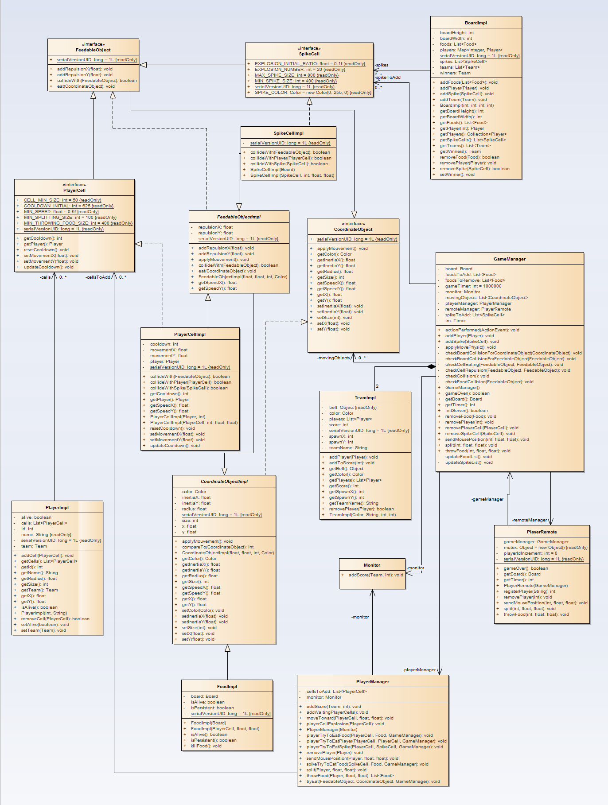
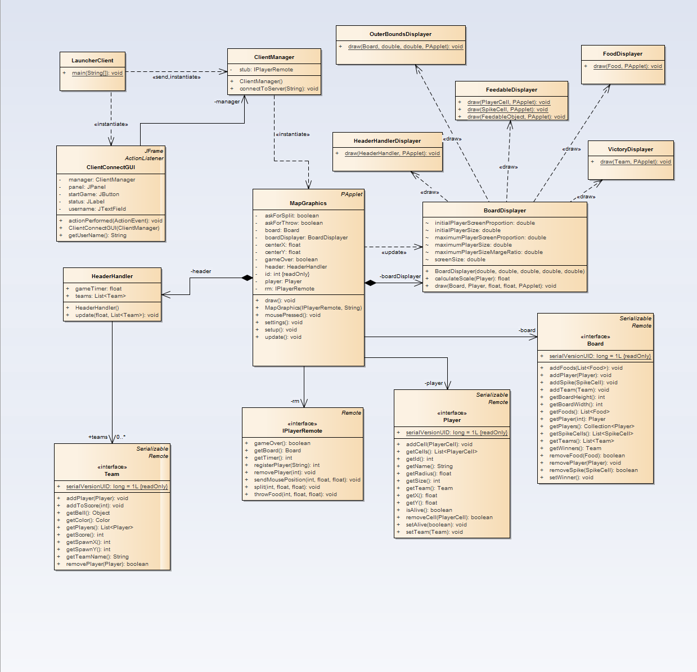

### This is a simple game to apply RMI, concurrency and AspectJ


### Server Model



### Client Model




### Intructions
- run the server
- run different instances of the client

## Game functionalities

### Player mechanics

#### Player movements

The player cells will move in the direction of the mouse on the board, if the cell will not move if the mouse is at it center. Player cell speed will decrease progressively that the player increase his size.  
The board display on the client will always place the player a the center of the board. If the player is divided into multiple cells, then the center of the player will be at an equal distance of the player cell the at most extreme distances (for exemple, on X coordinates, the player X will be between the first cell at the left and the last cell at the rigth :
```python
playerX = ( cellL.X-cellL.radius + cellR.X+cellR.radius ) / 2
```
)

#### Player splitting

With a left click on the mouse, the player will split himselft into two differents cells. If the players already have two cells or more, all the cells which size is greater than 100 will into two differents cells.  
When a player cell is splitting in two, one of the new cells will stay at the same place and the other will be throw in the direction of the mouse.  
When a cell split itself, the two new cell will not be able to gather again before a cooldown of ten seconds. If on of this two cells split again, the cooldown restart from the begining.

#### Throwing food

With a right click on the mouse, the player will throw a Food. The size of the food will be 5% of the cell who throw it and will be lost until the player eat the throwing food. The minimum size for a cell to throw food is 400, and if several player cells respect this condition, they will all throw a food.

#### Board view scale

When a player increase his size, the client vision on the board increase to avoid that the player fill the entire screen.  
The screen scale will alway consider the client as one unique cell, if the player split himself it' totaly possible that the majority of the cells stay at the center of the screen and that one cell (faster than the others) leave the screen.
The scale mechanic will work this way :
- if the player size is lower or equals to 50, le player cell will take 10% of the screen size (minimum value between the width oand the height f the screen)
- if the player size is greater or equal to 10,000 , the player cell will take 50% of the screen size.
- if the player is somewhere between this two values, the scale will progresively from 10% to 50% (linéar function depend on the player radius)  
```python
playerScreenProportion =  0.1 + (0.5 - 0.1) * ( (player.radius-radiusOf(50)) / radiusOf(10000))
newScreenSize = player.radius*2 / playerScreenProportion
screenScale = (initialScreenSize / newScreenSize)
```

### Board interactions

#### Cells type and interactions

We can find on the board 3 types of cell : Foods, Spike cells, Player cells.
Foods are cells that can't eat anything but that can be eaten by all others type of cells.
Player cell and Spike cells can both eat food. The player cell can eat spike cell or other player cell (the pigger eat the smaller) but te spike cell can only eat food.  

#### Board physic

When Feedable cell (player cells, spike cells) can't eat an other cell, the two cell will repulse each other to not allow them to overlap. The repulsion mechanic is apply at the meeting of two spike cells or the meeting of two player cells of the same team (special condition, if the player cell are from the same player and are not in split cooldown, thez can gather themself).  
We can also notice that the repulsion mechanic is apply on the board bounds.  
The last board mechanics appeare when a cell got inertia. This append when a player throw some food, or when a player cell or a spike cell split themself. In this conditions, this cell with inertia will continue it movement and eventualy bounce on the board bounds until it slow down.

#### Foods

On the board we can find everywhere some foods, this foods can be eaten by cells and will give 2 size point. When a food is eaten, it will reappeare at an other place of the board.  
The foods throw by players will fead a cell with theire size value and will not reappeare after being ate.

#### Spike cells

The spike cells (green cells on the board) will make player cells who eat it explode. The a player cell explode, it will split itself in a maximum of 20 new cells, the first cell will be 10% of the size of the original cell, the second 5%, and we continue to divide this ratio by 2.  
If the ratio make cells smaller than 50, so all the new cells will be 50 of size, and if the original cell become smaller than 100 (minimal size to be able to split), then we stop the explosion.  
All the new cells create will be throw in random directions, the original cell will stay at the same place.

```python
ratio = 0.1;
initialSize = cell.size;
for (int i = 0; i < 20; i++) :
    if (cell.size < 100) :
        break
    size = max((initialSize * ratio), 50)
    angle = random() * 360°;
    cell.player.addCell( new PlayerCell(size, cos(angle), sin(angle)) );
    ratio /= 2;
```


*Exemple of player explosion and gathering*

A spike cell appeare first appeare with a size of 400, if a player throw somme foods on a spike cell and (by eating foods) this spike cell reach 2 time it initial size, the spike cell will split into two new spike cells. On of the spike cell will stay at the same place and the other will be throw in the continuation of the direction that the last food who feed it. This is the only way to increase the number os spike cells.

### Game over

The score of the two team is equals to the size of all the players of the team. It is not possible to chose a team, a new player is add in the team with the lower number of member.  
At the end of the cooldown, the team with the greater score will win the game.  
For now, ther is only 2 team on the board, put it's easy to add some if needed. And to allow easier tests, when a player reappeare at his team spawn point, he will not have any protection to be eaten instantly.
